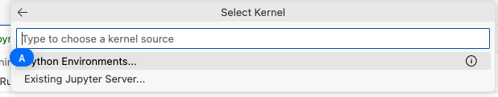
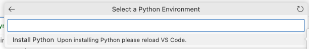
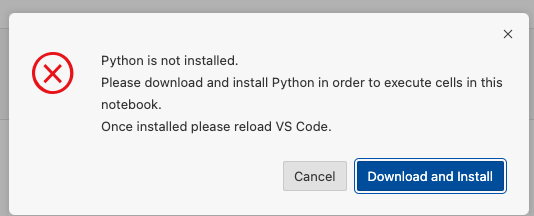
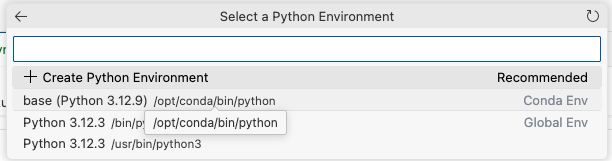
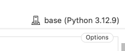
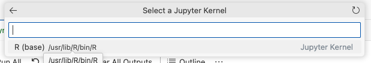

# GitHub Codespace for R Markdown/Notebook

**Launch the environment by clicking on the green Code button and creating codespace on main**


## Run R Markdown/Notebook

An example, `test.Rmd`, is ready to try.

**To render the test R Markdown into a PDF file, run the following line in R terminal**
```
rmarkdown::render("test.Rmd", output_format="pdf_document")
```

## Run R code in a Jupyter Notebook

Please try `notebook.ipynb`. But setup is required following the 9 steps below.

- Step 1:

From top right corner of the opened `notebook.ipynb` file pane.


- Step 2:



- Step 3:



- Step 4:



- Step 5: Select `base (Python x.x.x)`



- Step 6: Click on the top right corner button again to select kernel.



- Step 7: Choose `Select Another kernel...` 


- Step 8: Choose `Jupyter Kernel...`


- Step 9: Choose `R (base)`



Now `R` should appear at the lower right corner of each code cell to indicate that each code cell is with `R` kernel, and each code cell is runable.

**To render a Jupyter Notebook with R code to a PDF file, click on the `...` and select `export`**

